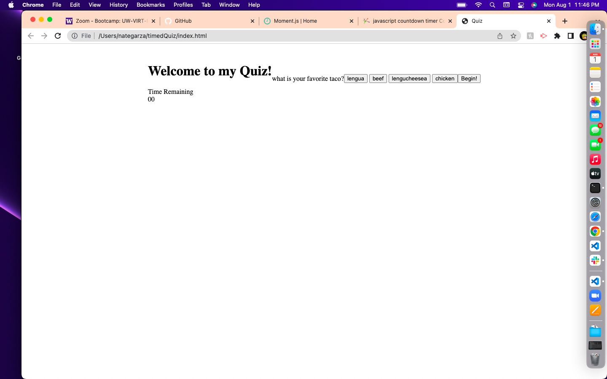

# This is my timed quiz project.

# For this timed quiz, I used mostly JavaScript to handle the functionality of the quiz.
# I stored my questions and answers in an array that was kept in an object, which I later called to display the question and answers on the screen.
# I created a timer counting down from 60 seconds, wasn't able to get that to fully function.
# I was not able to finish this project to completion, planning on a resubmit with a much more finished/polished application.

